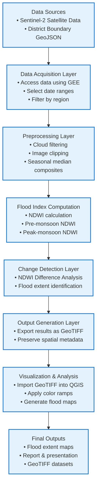

# Flood-Monitoring-Sentinel2-GEE

Flood analysis and mapping using Sentinel-2 satellite imagery and Google Earth Engine. This project detects flood-affected areas using NDWI, performs pre- and post-monsoon change analysis, and generates high-resolution flood maps to support disaster management and regional planning.

--- 

## Project Overview

This project focuses on flood detection and analysis using Sentinel-2 satellite imagery and Google Earth Engine (GEE). Floods are one of the most frequent natural disasters in India, especially during the monsoon season, causing severe damage to agriculture, infrastructure, and livelihoods.
The objective of this project is to identify flood-affected areas at district level by analyzing changes in surface water using satellite-derived indices and automated cloud-based processing.

--- 

## Objectives

- To analyze flood-affected regions using Sentinel-2 multispectral imagery
- To detect flood extent using the Normalized Difference Water Index (NDWI)
- To compare pre-monsoon and peak-monsoon satellite images to identify water spread
- To develop an automated workflow using Google Earth Engine
- To generate high-resolution GeoTIFF flood maps for visualization and analysis

---

## Dataset Used

- Sentinel-2 Optical Satellite Data (10 m resolution)
    - Source: European Space Agency (ESA) – Copernicus Programme
    - Accessed via: Google Earth Engine

- Study Region: Single district ( Kodagu, Karnataka)
- Time Periods:
    - Pre-monsoon: May–June
    - Peak-monsoon: August–September

--- 

## Methodology

- Data Acquisition
    - Sentinel-2 images filtered by date and region
- Preprocessing
    - Cloud filtering
    - Image clipping using district boundary
- Index Calculation
    - NDWI computation to highlight water bodies
- Change Detection
    - NDWI difference between pre-monsoon and peak-monsoon periods
- Visualization
    - Flood maps created using QGIS
- Export
    - Results exported as GeoTIFF files for further analysis

--- 

## High Level Architecture Diagram



--- 
## Technology Stack

- Google Earth Engine (GEE) – satellite data processing
- Sentinel-2 MSI – optical satellite imagery
- QGIS – map visualization
- GeoTIFF – raster data storage

---

## Repository Structure

```

├── gee_scripts/        # Google Earth Engine scripts
├── data/               # Exported GeoTIFF flood maps
├── qgis_maps/          # Styled maps and screenshots
├── docs/               # Project report / PPT
├── README.md           # Project documentation

```

--- 

## Output

- NDWI flood maps
- Flood extent comparison (pre vs peak monsoon)
- High-resolution GeoTIFF files
- Visual flood maps for presentation and reporting

---

## Team Roles 

- Vinay Krishna H S: Designs the flood analysis workflow and implements satellite data processing using Sentinel-2 and Google Earth Engine.
- Sujay M: Collects and preprocesses satellite datasets for flood detection.
- Karthik P: Creates flood maps and visualizations using QGIS.
- Sudeep A Biradar: Conducts literature survey and supports documentation and presentation preparation.

--- 

## License

This project is developed for academic and research purposes using open-source satellite data from the Copernicus Programme.
